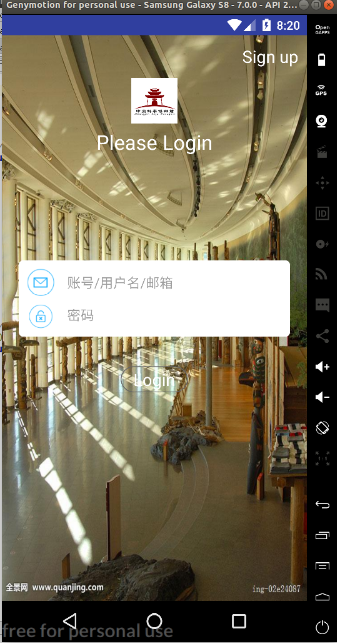
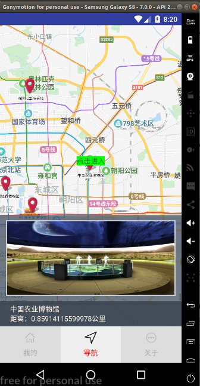

# Software-Engereering
> Author: Yuchao Gu

> E-mail: 2015014178@buct.edu.cn

> Date: 2018-05-27

>Description:北京化工大学1504班软件工程设计，我完成博物馆导览系统安卓开发

## 结果展示

### 登陆页面



### 个人首页


### 地图部分




### 地图二级展示


## 核心技术

### 地图页面
通过使用百度地图api，我实现了下述功能：

* 通过定位，获取当前经纬度
* 通过网络请求后台，获取十个离用户当前位置最近的博物馆
* 添加小弹窗，展示博物馆的图片与基本信息

### 二级展示页面
* 用户可以点击播放暂停，听当前博物馆的介绍信息
* 用户可以点击上传，上传自己的音频文件，上传功能使用七牛云完成，完成后请求写入数据库

### 页面布局
* 采用viewpager

## 总系统概览
总系统请参考：[`cs1504`](https://github.com/cs1504)

## 不足
本课设实现总体要求，但是存在以下不足：

* 页面美观欠缺
* 后台数据库中没有图片，故展览图片等为固定图片

## 代码结构
```
app/src/main
│
├── java/com
│   ├── bean  # 为后台数据交互时获取的数据构造的数据结构 
│   ├── example/guyuchao/myapplication # 各级页面代码
│   └── service # 音乐播放services代码
│ 
├──  res # 存放资源文件
│
└── AndroidManifest.xml # 配置文件
```

## 测试环境

* 代码环境：Android-studio 
* 真机环境：魅族
* API 版本: 24

